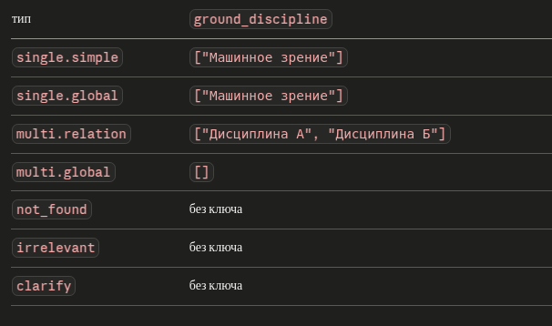

датасет:

** При изменении датасета надо запускать скриптик**

вид (пока такой, мб еще какие-то поля, но пока не знаю):

  {
    "question": "Сколько часов лекций по дисциплине Алгоритмы и структуры данных в языке Python?",
    "ground_truth": "32 часа",
    "router_type": "single.simple"
    "ground_discipline": ["Алгоритмы и структуры данных в языке Python"]
  },

~~надо дополнить правильные ответы, просто 32 не оч ответ, как минимум нужно 32 часа, а мб вообще развернутое прделожение.~~

~~максимально разнообразить по предметам фактологические вопросы~~

~~сделать вопросы более живыми: не писать полностью названия абсолютно правильно (напр. по дисциплине алгоритмы и структуры данных), добавить синонимы (дисциплина=курс=предмет)~~

~~добавить ground_discipline для каждого вопроса в виде списка~~

~~думаю все таки надо побольше вопросов.~~

~~в single.simple добавить вопросы: есть ли тема n в дисциплине t? с ответом да, и нет. ~~

подумать какие еще вопросы можно задавать, чтобы ответ был на них более распространеный. Мб таких и нет или они автоматом идут в глобал. Симпл вопросы видимо все будут искаться на прямую по ключам словаря и короткий ответ будет, мб можно на них сверху накинуть расширитель ответа.

так так, в датасет надо добавить вопросы под типы роутера: 

    NOT_FOUND      = "not_found"      - в вопросе не указана дисциплина, но вопрос по теме

    IRRELEVANT     = "irrelevant"     - в вопросе не указана дисциплина и вопрос не по теме. (кста случай когда есть дисциплина, но вопос не по теме - непонятный случай хахахаах)

    CLARIFY        = "clarify"        - есть дисциплина в запросе, но она не из списка рпд. Такое может быть в single.simple, single.global, single.relation (и обе надо, и одна, и надо бы сделать вопрос где 3 дисциплины)

to do:

 0. доработать скрипт для датасетов, не знаю пока какие группы надо выделить, но надо ахах 

 1. ~~убрать пока вообще time_filter~~

 2. изучить логи, на их основе надо будет доработать каждый промпт
    
    ~~2.1. особенно промпт роутера, как-то иначе надо классифицировать simple.global (не во всех таких вопросах есть ключевые слова 'все')~~

    Поменяла логику, теперь сначала ищем в запросе дисциплины (сверяем со списком имеющихся), потом по их количеству делаем выводы и по разному действуем. Добавила вариант вопросы не по теме совсем (выводим сообщение пользователю) и по несуществующей дисциплине (другое сообщение).

 3. эксперименты: 

    ~~промты на английском~~ подумала и решила, что для ллм хорошо работают примеры в промте, если их сделать на англе, то норм не напишешь, так что не будем; надо бы это указать в тексте!!! 

    посмотреть по логам где мб дипсик плохо работает и попробовать другую модель; 

    посмотреть как отработала модель оценки, мб тоже попробовать другую (но это мб будет дорого);

    мб для simple.simple возможно вообще можно упростить оценку, использовать модель проще 

    retrieval по summary and questions  vs retrieval по summary
    ...

 4. в оценку надо добавить метрику классификации названия предмета (перед этим доработать датасет, разнообразие названий в вопросах сделать)

 5. особенно интересно что там у нас с expander.py, возможно ныняшняя его работа нам ничего не дает (опять же логи, подумать как вообще оценить полезность этих методов)

 6. текст вкр: я бы переписала раздел про агента

  6.1. перенесла бы этот раздел на номер выше (наша система тип последняя будет идти)

  6.2. назвала бы его: разбор графовых систем

  6.3. описала бы в нем ту систему и еще hipporag2, кратко архитектру и идеи из статей (с иточниками)

  6.4. ну и подводим итог, что нам это все не подходит из-за семантической близости наших документов, перейдем к нашей ахуенной системе

  6.5. если убираем с концами time_filter не забыть его убрать из схемы!!!!! схему надо будет вообще плотно менять

  6.6. надо там еще написать кусок про indexing, можно это сделать как раз по доку в этой репе

7. ~~есть ошибка в индексации, надо полностью заново запускать. Еще раз подумать над эмбедингами. Перед перезапуском изучить саммари.~~
  Сделала новую индексацию, там теперь саммари и по три вопроса на каждый блок, и по их эмбедингам будем делать retrieval. Дополнительно считаю между саммари и вопросами схожесть, можно об этом будет где-то сказать. И надо будет сравнить.

8. multi.relation явно ищется не так как надо, я хочу чтобы он фильтранулся по найденым названиям в запросе и и раздельно в каждом предмете сделал поиск по подзапросам, которые корректно сделал expander.......

9. ~~перенести все промты основного пайплайна в prompts.py~~ все кроме eval(так и должно быть).

10. верификация для simple вопросов может быть упрощена, а для global наоборот

11. надо в логи добавить вывод найденной дисциплины, или вообще ответ модели пполностью, разобраться с логами, выводить реально полезные.

 Выяснила, что логи можно автоматом писать в файл, надо будет так везде сделать.

12. сделать файл с командами проверками всяких случаев интересных

13. разобраться с direct extraction, он явно даже для простых самых вопросов делает перефразировки и тд, а это запрос к ллм, долго, платно - лишнее. Надо этот будет фиксить

14. ~~самый сложный промтп PROMPT_CLASSIFY_SINGLE, надо его потестить.~~ Пока не трогаем.

15. ~~в случае multi.relation если есть название дисциплины не в реальном списке, то он просто скипает его и идет дальше. Надо обработать~~ вроде сделала, но надо еще мессадж покрасивше сделать

16. сейчас фуззи поиск делает такое:
INFO:__main__:[5/24] Какая форма промежуточной аттестации в курсе машинное зрение?
INFO:pipeline:=== Запрос: Какая форма промежуточной аттестации в курсе машинное зрение?
INFO:httpx:HTTP Request: POST https://rus-gpt.com/api/v1/chat/completions "HTTP/1.1 200 OK"
INFO:router:Extracted names from query: ['машинное зрение']
INFO:router:Fuzzy candidates: ['машинное зрение', 'машинное обучение в семантическом и сетевом анализе']
INFO:router:Not found names: []
INFO:httpx:HTTP Request: POST https://rus-gpt.com/api/v1/chat/completions "HTTP/1.1 200 OK"
INFO:router:LLM extraction status: found
INFO:httpx:HTTP Request: POST https://rus-gpt.com/api/v1/chat/completions "HTTP/1.1 200 OK"
INFO:router:Router: type=QueryType.SINGLE_SIMPLE  disciplines=['машинное зрение']
INFO:retrieval:'машинное зрение' -> 'Машинное зрение' (1.00)

  думаю надо повысить порог

17. _parse_json надо вынести в отдельный файл и посмотреть есть ли еще такие методы вспомогательные, которые используются не раз

18. потом надо будет разложить в папки pipeline, evaluate

**Запуск 30.04 10:00**

все синглы правильно классифицирует, пока не трогаем

**Примеров:** 41  
**Модель-судья:** qwen/qwen3.5-397b-a17b

**Router Accuracy:** 0.951

| Метрика | mean | std |
|---------|------|-----|
| Faithfulness | 0.00 | ±0.00 |
| Answer Relevancy | 0.00 | ±0.00 |
| Answer Correctness | 0.00 | ±0.00 |
| Response Time | 49.79s | ±39.23s |

**Низкое качество (≤2 по любой метрике):** 0/41

| Тип | N | F | R | C | Router |
|-----|---|---|---|---|--------|
| single.simple | 14 | 0.00 | 0.00 | 0.00 | 1.000 |
| single.global | 10 | 0.00 | 0.00 | 0.00 | 0.900 |
| multi.relation | 12 | 0.00 | 0.00 | 0.00 | 1.000 |
| multi.global | 5 | 0.00 | 0.00 | 0.00 | 0.800 |

